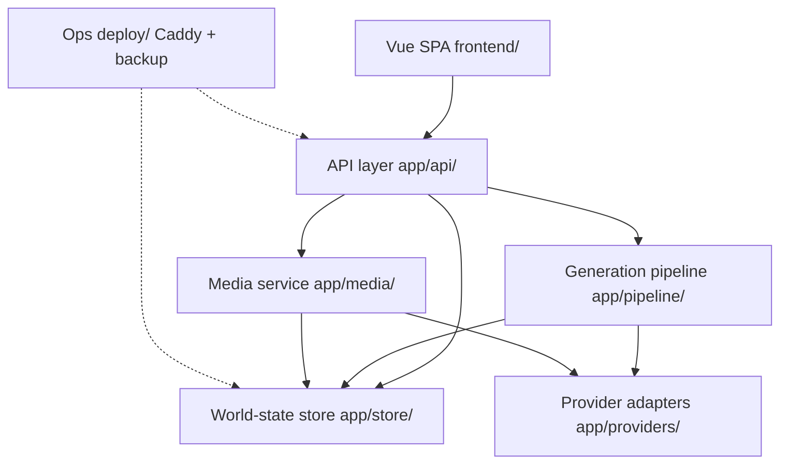
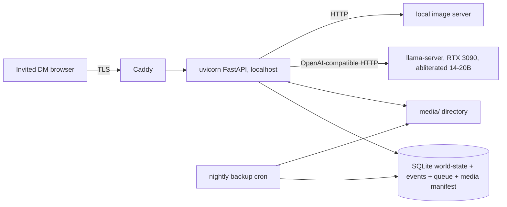
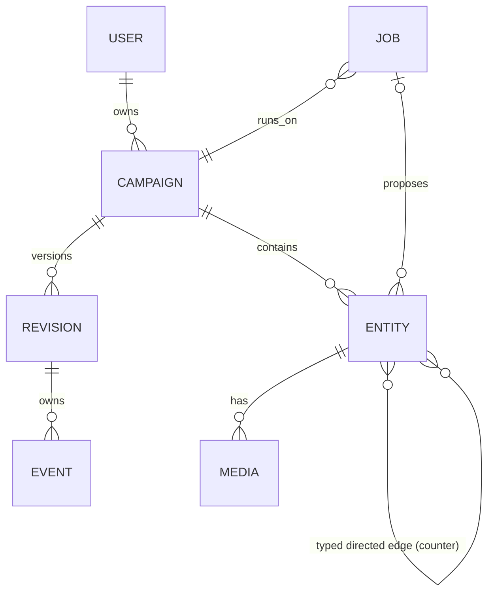

# Architecture Spine — mythosCircle

## Design Paradigm

**Event-sourced graph-of-record + FIFO generation pipeline.** The world is a versioned graph stored as an append-only event log with a materialized latest revision. Everything that changes the world — guided world-build-in, generation, DM edits, future imports — stages its change and lands through one transactional commit path that produces a new revision. Generation itself is a single serial worker queue: LLM output never writes to the graph directly; it produces *candidates* that only exist until the DM accepts one.

Layers → namespaces:

| Layer | Lives in |
| --- | --- |
| Web client (Vue SPA) | `frontend/` |
| API service (FastAPI) | `backend/app/api/` |
| World-state store (revisions, event log, queue, media manifest) | `backend/app/store/` |
| Generation pipeline (retrieval, generators, commit) | `backend/app/pipeline/` |
| Provider adapters (LLM, image, video) | `backend/app/providers/` |
| Media service | `backend/app/media/` |
| Ops (Caddy TLS, backup/restore, systemd) | `deploy/` |

## Invariants & Rules

### AD-1 — One graph-of-record, one commit path

- **Binds:** PRD §3 A, §4 NFR 2
- **Prevents:** two builders picking different world-state shapes (graph vs. per-entity documents) or letting DM edits and generation write by separate mechanisms.
- **Rule:** the world is one versioned graph (entities + typed edges) per campaign. Every world-state change — guided build-in, generation accept, DM edit, cascade delete, future import — lands through the store's commit path, which appends events and produces exactly one new revision. No component outside `store/` writes world state.
- **Exception (campaign creation):** a campaign is a private, owner-bound identity record with seed content; it commits no revision/event because the campaign is identity/config, not a graph delta (spec-1-6 Design Notes). All subsequent world-state changes inside a campaign still land through the commit path and produce one revision each.

### AD-2 — Atomic subgraph commits; per-transaction undo

- **Binds:** PRD §4 NFR 3
- **Prevents:** partial generations (3 of 5 entities committed) and an undo that crosses a generation boundary.
- **Rule:** a candidate's full subgraph commits in one transaction against the latest revision. Every commit produces exactly one revision; the revision owns its events (each event carries `revision_id`) and undo = one compensating commit that reverts that revision's state deltas. A DM edit made while a candidate is being evaluated forces a visible choice: rebase the candidate against the new revision or reject it — never silent overwrite. Accepting a regeneration of an existing entity replaces its content in place, preserving the entity's ULID — inbound edges, media, and references survive; edge re-targeting is forbidden.

### AD-3 — Single FIFO queue, persisted, position visible

- **Binds:** PRD §4 NFR 4
- **Prevents:** two builders choosing concurrent inference (VRAM OOM on one GPU) or an in-memory queue that dies on restart.
- **Rule:** all generation jobs (text, image, video, simulate) enter one persistent FIFO queue; exactly one job runs at a time on the 3090; clients see their job's queue position (REST + WebSocket). No bypass path around the queue. Each job kind has one runner: text/build-in jobs run in the pipeline, image/video jobs run in the media service — both dispatch only through the queue worker.

### AD-4 — Retrieval over the graph, never whole-world context

- **Binds:** PRD §4 NFR 2, 11
- **Prevents:** context-bloat and two builders inventing different relevance rules.
- **Rule:** generation prompts are built from a bounded neighborhood of entities selected by strict graph traversal (AD-16); the full world never enters a prompt.

### AD-5 — Closed, directional edge vocabulary; zero dangling edges

- **Binds:** PRD §3 A
- **Prevents:** free-form labels that the Phase-3 rule engine cannot consume, and orphaned edges that compute wrong consequences.
- **Rule:** edge types come from a fixed vocabulary defined in Phase 1 (relationship, debt, grudge, loyalty, member_of, located_in, rival_of, kin_of, ally_of, enemy_of — starter set, extensible by adding a type, never by free text); edges are directed and carry a per-type counter (semantics in AD-23). Deleting an entity with live edges requires explicit cascade confirmation listing affected entities; referential integrity (zero dangling edges) holds after every commit.

### AD-6 — Provider abstraction via OpenAI-compatible endpoints

- **Binds:** PRD §4 NFR 8
- **Prevents:** vendor lock-in and a rewrite at OpenRouter migration.
- **Rule:** all LLM / image / video generation goes through provider adapters speaking OpenAI-compatible HTTP; moving from local to OpenRouter (or another vendor) is a config change, not a rewrite.

### AD-7 — Deterministic state, narrating LLM

- **Binds:** PRD §3 G
- **Prevents:** the LLM drifting into state-mutation, which compounds hallucinations and breaks determinism.
- **Rule:** LLM output may *propose* state (candidates) but only the DM-accepted commit mutates the graph. Session actions are typed events (action_type, actors, targets, campaign_time in the campaign's AD-18 unit, note) appended to the same event store, where actor/target references are ULIDs and `action_type` is a closed set (Phase 1: `session_action`, `advance_time`); campaign time advances only via `advance_time`. A Phase-3 rule engine will consume events to compute deltas; the LLM only narrates those deltas.

### AD-8 — Single-machine deployment

- **Binds:** PRD §4 NFR 1
- **Prevents:** distributed-component decisions (message brokers, object stores, k8s) that a one-server beta cannot run.
- **Rule:** the whole Phase-1 system runs on the owner's machine: one FastAPI process, one SQLite file, one media directory, local model servers, Caddy in front. Scaling, multi-node, and hosted tiers are out of scope until proven otherwise.

### AD-9 — Invited accounts, per-campaign ownership, private

- **Binds:** PRD §4 NFR 6
- **Prevents:** two builders assuming public registries or party-shared campaigns in Phase 1.
- **Rule:** Phase 1 auth = local email + password, carried in an httpOnly session cookie (Secure, SameSite=Lax, path `/api`); every campaign belongs to one invited user and is private. Sharing (cards/gallery, party-shared) is post-beta and must re-enter through AD-1's commit path, not around it.

### AD-10 — Media owned by entities

- **Binds:** PRD §3 C
- **Prevents:** orphaned 24GB of portraits, and exports referencing dead files.
- **Rule:** media files live in `media/{campaign_id}/{entity_id}/`, are tracked in the DB media manifest, are written only by the media service, are reclaimed when their entity is deleted, and are reference-validated on export.

### AD-11 — Export is read-only, latest revision, validated

- **Binds:** PRD §3 E
- **Prevents:** exports mutating state or shipping unvalidated artifacts that break the "table-ready" promise.
- **Rule:** export reads the latest revision, produces a format-validated artifact (Markdown / Owlbear / RPGToken / Fantasy Grounds) with the stat block and portrait embedded, and counts validation failures as export-failure events. Stat blocks follow the SRD 5.1 field set (level for NPCs, CR for monsters). Owlbear export = media-service image URL + stat-block text (it has no documented token-JSON import); the full world state (all entities + typed edges + counters of the latest revision) is always exportable as JSON + Markdown, independent of VTT targets. Export never writes.

### AD-12 — Nightly snapshot + tested restore

- **Binds:** PRD §4 NFR 5
- **Prevents:** "exportable" being treated as a backup.
- **Rule:** a scheduled job snapshots the world-state DB (via the SQLite backup API — `VACUUM INTO` or `wal_checkpoint` + copy, never a raw file copy of a WAL-mode database) + media manifest to a second location on the machine; a restore script is exercised before beta launch and must restore from that exact snapshot path. Export is ownership, not backup.

### AD-13 — SQLite is the single state store `[ASSUMPTION]`

- **Binds:** all
- **Prevents:** two builders splitting state (Postgres for state + JSON for events + in-memory queue).
- **Rule:** one SQLite database holds world state (current revision tables), the append-only event log, job queue, media manifest, and accounts. WAL mode; single writer (the API process). All access through `store/` — no raw SQL elsewhere.

### AD-14 — Local LLM served as an OpenAI-compatible server `[ADOPTED, user-verified]`

- **Binds:** AD-6
- **Prevents:** the pipeline binding to one server's internals (llama-cpp-python vs. vLLM vs. REST) — which also decides how the abliterated model loads.
- **Rule:** the abliterated 14–20B model runs in a local OpenAI-compatible server process (llama.cpp `llama-server` is the seed choice: serial queue, Q4/Q5 on 24GB); the pipeline talks HTTP only. Model path + server command live in deploy config (owner picks the model at build).

### AD-15 — Candidates are staged, not live `[ASSUMPTION]`

- **Binds:** PRD §3 B
- **Prevents:** rejected candidates leaking into the graph (a graveyard of unaccepted barkeeps).
- **Rule:** generated candidates exist as *proposed* subgraphs in a staging area (DB rows, flag `proposed`), invisible to retrieval and export. Each proposal carries a `kind` — `build_in` | `entity` | `field` — and validation is per-kind (AD-24's shape applies to `entity` only; `build_in` proposals have no stat blocks; `field` proposals are scoped to one field of one entity). Accept = one transactional commit (AD-2). Reject/timeout = GC of the proposal. A proposal is all-or-nothing: a partial generation failure rolls back the whole candidate.

### AD-16 — Deterministic graph retrieval, no RAG

- **Binds:** AD-4, PRD §4 NFR 2, 11
- **Prevents:** embeddings, similarity, and "relevance" nobody can audit — a world state that drifts from what generation actually saw.
- **Rule:** retrieval is a bounded graph traversal from the target entity over typed edges (depth cap, entity cap — seed: 24 entities) against the latest revision. The prompt receives hard truths only: the full structured record of each reached entity (attributes, counters, goals, economy) plus its generated text, plus the request. No embeddings, no similarity, no full-text search. Same state + same request ⇒ same prompt.

### AD-17 — API + client contract `[ASSUMPTION]`

- **Binds:** all
- **Prevents:** drifting ID formats, error shapes, and progress channels between backend and Vue builders.
- **Rule:** REST for CRUD + job submission; WebSocket for job progress/queue position, messages shaped `{type: job_progress|job_done|job_failed|queue_changed, job_id, state, queue_position?, progress?}`. The wire contract is owned by the backend: Pydantic schemas are the single source of truth, and the frontend derives its types from the generated OpenAPI. IDs are ULID strings, prefixed in logs only (`entity:`, `edge:`, `job:`, `event:`); timestamps UTC ISO-8601; error envelope `{code, message, details?}`; 4xx = user error (never a state change), 5xx = server error.

### AD-18 — Campaign time is a campaign timescale, not wall clock

- **Binds:** PRD §3 F, G
- **Prevents:** Simulate History depending on real time (a deterministic simulation can't run twice on different dates), and a day-counter that can't run century-long campaigns.
- **Rule:** each campaign declares a time granularity (day / month / year / century) and calendar label. Session events advance campaign time; action events and simulation input reference campaign time units; no wall-clock value enters simulation input.

### AD-19 — All entry paths share staging → commit `[ASSUMPTION]`

- **Binds:** PRD §3 A, §7 Later
- **Prevents:** the Phase-1 guided build-in and the Later import connectors (Obsidian/World Anvil/Kanka) each inventing their own writers.
- **Rule:** guided build-in is a job kind that digests notes into a proposed subgraph (AD-15); Later import connectors produce proposed subgraphs through the same pipeline. There is exactly one writer to world state: the commit path (AD-1).

### AD-20 — Vue 3 SPA, TypeScript, Pinia `[ASSUMPTION]`

- **Binds:** PRD §4 NFR 12
- **Prevents:** framework re-architecture when the Phase-2 graph UI lands.
- **Rule:** Vue 3 + Vite + TypeScript + Pinia; the Phase-2 graph visualizer (Cytoscape.js vs. Vue Flow) is a contained view dependency — it reads world state from the Pinia stores and never fetches or owns state (no direct API calls, no private caches).

### AD-21 — Caddy TLS front `[ASSUMPTION]`

- **Binds:** AD-9, PRD §4 NFR 6
- **Prevents:** hand-rolled TLS/cert management on a personal server.
- **Rule:** Caddy terminates TLS in front of uvicorn; FastAPI binds localhost only.

### AD-22 — Config: one TOML + env secrets `[ASSUMPTION]`

- **Binds:** all
- **Prevents:** config scattered across dotenvs, YAMLs, and code defaults that drift per-environment.
- **Rule:** one `deploy/config.toml` (model paths, queue caps, retrieval k, provider URLs) + environment variables for secrets (tokens, OpenRouter keys later). No config in the client build.

### AD-23 — Hard-truth entity model; relationships carry counters

- **Binds:** PRD §3 A, G
- **Prevents:** world state becoming a bag of free-text lore the simulation cannot touch, and two builders modeling goals/lifespan/economy differently.
- **Rule:** every entity carries structured hard truths — character: goals, life span, stat block; faction and place (city/country subtypes): goals, abstract economy (level + growth + key resources), member/located relations. Every relationship is a typed directed edge with a counter whose semantics are defined per type (debt = amount, grudge/loyalty = score, ally/enemy = intensity). Counters change only via commits (session events, time progression). The Phase-3 simulation reads and writes counters deterministically; the LLM only narrates the outcome.

### AD-24 — Candidate shape contract

- **Binds:** PRD §3 B (acceptance B)
- **Prevents:** builders modeling candidates without the secret/rumor/hook triple or the existing-world edge — silently dropping the product's core promise ("the barkeep's secret pays off in act three").
- **Rule:** each generation ask returns 2–3 candidates; every candidate carries a name, role, personality, the secret / rumor / party-hook triple, a 5e stat block (AD-23), and at least one typed edge into existing world state. Acceptance validates the ≥1 existing-world edge before the AD-2 commit.

### AD-25 — Whole-campaign deletion is total

- **Binds:** PRD §4 NFR 10
- **Prevents:** campaign delete implemented as soft-hide or partial cleanup, orphaning state, event history, and media.
- **Rule:** deleting a campaign is a hard delete through the store, with explicit confirmation: revision tables, event log, queue entries, media-manifest rows, and the campaign's media directory are all removed.

## Consistency Conventions

| Concern | Convention |
| --- | --- |
| Naming | `snake_case` Python, `kebab-case` API routes, `camelCase` TS/Vue; entity/edge/job/event IDs are ULIDs |
| Data & formats | UTC ISO-8601 timestamps; error envelope `{code, message, details?}`; cursor pagination |
| State & cross-cutting | mutation only via store commit; structured JSON-lines logs to file; generation failures never mutate state; all jobs idempotent by job-id; each job declares a max LLM/media call budget from config — exceeding it fails the job |
| Testing | store + pipeline carry unit tests for commit/undo/retrieval (deterministic fixtures); no UI e2e in beta (owner dogfoods) |

## Stack

*Seed — verified at Finalize; the code owns this once it exists.*

| Name | Version |
| --- | --- |
| Python | 3.12 |
| FastAPI | latest stable (0.14x as of 2026-08) |
| SQLAlchemy 2 + SQLite (WAL) | 2.x |
| Pydantic | v2 |
| Vue | 3.5 |
| Vite + TypeScript | 8.x / 7.x |
| Pinia | 4.x |
| llama.cpp (`llama-server`) | latest stable |
| Caddy | 2.x |
| Image/video model | owner picks at build (adapter interface already bound, AD-6) |

## Structural Seed

Dependency direction (who may depend on whom):



Rule the diagram encodes: `api/` orchestrates; `pipeline/` proposes; `store/` commits; `providers/` are leaves (no inbound deps except from pipeline/media); nothing except `store/` writes world state.

Deployment (single machine — AD-8):



Core entities (names + relationships only):



Minimal tree:

```text
mythosCircle/
  backend/
    app/
      api/        # routes: campaigns, entities, edges, jobs, media, exports, auth
      core/       # config, auth, errors, events
      store/      # revisions, event log, commit path, queue, media manifest
      pipeline/   # job runner, retrieval, generators (character/faction/place/simulate)
      providers/  # llm, image, video — OpenAI-compatible adapters
      media/      # media service (write/reclaim/validate)
    tests/        # store + pipeline unit tests
  frontend/
    src/          # Vue SPA: views per capability, Pinia world-state stores
  deploy/         # config.toml, caddy, systemd units, backup cron + restore script
```

## Capability → Architecture Map

| Capability / Area | Lives in | Governed by |
| --- | --- | --- |
| A. World state | `store/` | AD-1, 2, 5, 13, 23 |
| B. Entity generation | `pipeline/` → `store/` | AD-2, 3, 4, 15, 16, 19 |
| C. Media generation | `media/` + `pipeline/` | AD-3, 6, 10 |
| D. Relationship graph *(P2)* | `frontend/` (view only) | AD-20 |
| E. Export & VTT | `api/` (read-only) | AD-10, 11 |
| F. Session logger *(P3)* | `api/` + `store/` events | AD-7, 18, 23 |
| G. Simulate History *(P3)* | `store/` events → rule engine (future) | AD-7, 18, 23 |

## Deferred

| Decision | Revisit when |
| --- | --- |
| Image/video model + server choice (interface already bound) | at build, owner's call |
| Graph traversal performance (neighborhood materialization/caching) | graph outgrows per-commit traversal |
| Graph visualizer library (Cytoscape.js vs. Vue Flow) | Phase-2 build |
| OpenRouter endpoints + credit multipliers | post-beta migration (PRD §5) |
| Session-recording transcription | Phase 3 |
| Simulate History rule engine (rule authoring, delta correctness) | Phase 3 spec |
| i18n (Turkish) | if beta DMs are non-English |
| Scaling beyond one machine / hosted tier | after beta proof |
| OAuth / third-party auth | with the sharing experiment (post-beta) |
