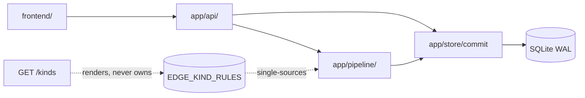

# Architecture Spine — mythosCircle v3 slice

Slice of the 08-23 platform spine. Parent `AD-1`–`AD-25` bind read-only; new IDs continue the parent sequence (`AD-26+`) so nothing collides and nothing is renumbered.

> Supersedes `EXPERIENCE.md` Tier-2 on two points: parallel tables → one logbook (AD-26/AD-28); knowledge 3-state → secret↔known toggle (AD-29). The spine wins on conflict.

## Design Paradigm

Inherited whole: event-sourced graph-of-record + FIFO generation pipeline. This slice adds no paradigm — one logbook (AD-26), rows-behind-the-log (AD-28), and content-rendered rules (AD-34) are the paradigm applied, not extended.

Call-time direction holds: `pipeline -> store`. Named exception: `store/direct.py` reuses the shared AR25 validator via function-level import (`app.pipeline.knowledge`) — a shared definition, not a layer inversion; no further store→pipeline reference may be added. The kinds endpoint reads the matrix; nothing writes it at runtime.

## Inherited Invariants

| Inherited | From parent | Binds here |
| --- | --- | --- |
| Paradigm: event-sourced graph-of-record + FIFO pipeline | 08-23 | Whole slice; AD-26 is composition, not extension |
| AD-1 one commit path, exactly one writer | 08-23 | AD-26/AD-28 extend coverage to run-state; writer count stays one |
| AD-2 atomic subgraph commits; per-transaction undo | 08-23 | AD-27 take-back semantics; verb commits are subgraph commits |
| AD-3 single FIFO queue, persisted | 08-23 | Guided regenerate/enrich ride existing job kinds; repair attempts count against the job call budget |
| AD-5 closed directional edge vocabulary | 08-23 | AD-30/AD-31 delta discipline; AD-32 reason rides every type |
| AD-7 deterministic state, narrating LLM; typed session events | 08-23 | AD-26 verb/toggle events join the same stream with ULID refs |
| AD-9 invited accounts, per-campaign ownership | 08-23 | AD-35 read endpoints enforce ownership like every route |
| AD-11 export read-only, latest revision, validated | 08-23 | Exporter reads entity/edge only — state rows and the log never leak |
| AD-13 SQLite single state store | 08-23 | AD-28 rows live in the same DB, same transaction |
| AD-15/AD-19 staged candidates; all entry paths share staging → commit | 08-23 | Enrich adds no job kind, no second pipeline (AD-33 repairs the same one) |
| AD-23 hard-truth model; per-type counter semantics | 08-23 | Counter rules untouched; reason is alongside, never instead |
| AD-24 candidate shape contract (≥1 existing-world edge) | 08-23 | Drop-with-audit backstop: thin candidates still fail loud |

## Invariants & Rules

### AD-26 — One logbook for canon and table-state [ADOPTED]

- **Binds:** run-loop-tier-2, store
- **Prevents:** canon alive in one stream while table-state says defeated in another (independent rewind divergence)
- **Rule:** Tier-2a verbs and Tier-2b toggles commit through the existing store commit path into the shared `revision` + `event` stream. No second writer, no parallel log; divergence is unrepresentable. Verb/toggle events carry the full resulting state in payload (rebuild-faithful). Rows are authoritative for reads, the log for history and undo; rebuild-from-log is a legal recovery op only, never routine.

### AD-27 — Take-back is per-transaction compensating commit [ADOPTED]

- **Binds:** run-loop-tier-2, store, frontend (change-line)
- **Prevents:** two history vocabularies; rewinding a verb silently rewinding later canon edits
- **Rule:** take-back appends the inverse deltas of exactly its own transaction (AD-2 mechanics) onto current state (surgical): a same-field later edit is preserved arithmetically, never overwritten — enrich's hp 35 plus a −12 inverse lands 23, not 40. Later commits stand. Verb commits and their take-backs both render as `edited` in recent changes — the feed never distinguishes undo from edit, and take-back entries are always listed, never filtered.

### AD-28 — Run-state rows behind the log; `session` means the table [ADOPTED]

- **Binds:** run-loop-tier-2, store
- **Prevents:** N smart readers deriving state N ways; two meanings of `session` one grep apart
- **Rule:** `entity_session_state` and `entity_knowledge_state` are first-class committed rows written in the same transaction as their events (the entity/edge rows+log precedent). Roster/cast/chip reads are joins; readers stay dumb. The login session table renames to `login_session` — table, model, and every reference (auth middleware et al), with migration for live DBs; `session` henceforth means tonight's table.

### AD-29 — Knowledge is a per-secret known-toggle [ADOPTED]

- **Binds:** run-loop-tier-2, frontend (knowledge chip)
- **Prevents:** a middle state no flow needs; party-knowledge dye in the record
- **Rule:** each secret/rumor/hook carries one DM toggle, `secret` ↔ `known`, flippable either direction at any time, one undoable step each way. No `shown-to-me`. The record never changes — only the marker moves. Transaction boundaries follow the save gesture: a standalone flip is its own revision; an edit+flip saved together is one atomic revision whose take-back inverts both halves. "One undoable step" = one transaction.

### AD-30 — Strict per-kind edge restrictions stand [ADOPTED]

- **Binds:** edge-vocabulary-delta, pipeline, frontend (pickers)
- **Prevents:** the relationship swamp (d7: 100/114 rows in the catch-all); malformed edges from generation and user edits alike
- **Rule:** no flatten to anyone→anyone. Kind-checks stay deterministic over the closed vocabulary for model output and hand-authored edges both.

### AD-31 — Matrix delta: place-employ, place-control, part_of pairs [ADOPTED]

- **Binds:** edge-vocabulary-delta, store, pipeline, frontend (pickers)
- **Prevents:** the city that cannot hire its watch-captain; the fort that cannot hold its valley; people modeled as *part of* places
- **Rule:** `employs` src += `place`; `controls` src += `place`; `part_of` = `{place, faction}` → `{place, faction}`. All other cells frozen. `part_of` counter semantics: neutral (counter must be 1). Availability derivation is one function — `edge_kind_ok(matrix)` per (type, src_kind) — for prompts, validators, pickers, and the pin test alike. One matrix edit propagates to all four; nothing else moves.

### AD-32 — Every edge carries a saved reason [ADOPTED]

- **Binds:** edge-vocabulary-delta, pipeline, store
- **Prevents:** the second half of the swamp — generic edges that say nothing (same type+target, opposite meanings, unrepresentable)
- **Rule:** the model writes one reason per edge; the commit path rejects blank on new edges; the row persists it. Blank includes empty string and whitespace. Non-blank re-enforced on retarget (new src/dst/type = new meaning); counter-only bumps preserve the stored reason. Pre-reason rows grandfather `NULL` — never blocking; repair may fill NULLs opportunistically. Counter semantics (AD-23) untouched.

### AD-33 — Repair-then-drop with fill-blank guardrails [ADOPTED]

- **Binds:** guided-regenerate, pipeline
- **Prevents:** one blank sentence voiding minutes of generation; repair loops re-echoing whole entities; lying fills (`N/A`) poisoning the graph
- **Rule:** one bounded attempt per blank: the saved JSON returns with only the missing field asked for (single-field response schema, grammar-enforced where backends allow); code merges field X alone and discards the rest; blank/null-prose (`none`, `n/a`, `unknown`, `...`) counts as missing. Blank edge reason is fill-blank class: the stashed wave-1 edge is the base, the single-field reply supplies reason only. Then drop-with-audit — and the AD-24 ≥1-edge floor converts thin candidates to loud failures. Missing-field → fill-blank; malformed → existing re-derive repair. Attempts count against the job call budget. Enrich accept is regeneration-in-place (same ULIDs; inbound edges and media survive per AD-2).

### AD-34 — Registry truth is code-wins [ADOPTED]

- **Binds:** registry, store, frontend (pickers)
- **Prevents:** the accept-time rejection class (picker offers what commit drops, or hides what commit allows)
- **Rule:** `GET /api/campaigns/kinds` renders `EDGE_KIND_RULES` (plus dial tables, archetypes, per-kind availability derived from the same source). The endpoint owns no vocabulary; nothing writes it at runtime. Kinds payloads carry a matrix version token; pickers re-fetch per walk mount, never baked into bundles; commit-time validation against the live matrix is the backstop.

### AD-35 — New read surface is read-only and owned [ADOPTED]

- **Binds:** registry, run-loop-tier-1
- **Prevents:** Tonight reads becoming a write path; cross-campaign leakage through synthesis endpoints
- **Rule:** `GET /api/campaigns/{id}/revisions?limit=N` and `GET /api/campaigns/kinds` are read-only under AD-9 ownership like every route. Event summaries are display-ready `{revision_id, created_at, actor, action, target_names, kind}` under owner-only readership. Revisions reads default 20, max 100. Kinds responses are cacheable within a version token; revision reads carry meta + event summaries only.

### AD-36 — Dial and archetype live in the record [ADOPTED]

- **Binds:** registry, store, pipeline, export
- **Prevents:** writer/renderer/exporter disagreeing on an entity's depth; re-rolls shedding the DM's dial
- **Rule:** `dial` is a top-level record key (`DIRECT_KEYS` +1) and `archetype` sits on place/faction. Both survive export, import, and re-rolls. A record predating them reads dial as authored-or-absent, never as an error.

### AD-37 — Flat stays flat until the DM acts [ADOPTED]

- **Binds:** run-loop-tier-1, store
- **Prevents:** a migration rewriting canon; lazy rows rendering as broken
- **Rule:** no migration of existing flat entities. Flat rows render with the enrich nudge and grow sections only through the DM's enrich verb (AD-33 engine).

### AD-38 — Enrich is regenerate with a shaped request [ADOPTED]

- **Binds:** guided-regenerate, pipeline
- **Prevents:** a second pipeline growing beside regenerate; enrich inventing its own job kind
- **Rule:** enrich requests are regenerate requests with per-kind sections, `sections: null`, guide text, and dial level — one engine, existing job kinds, candidates/accept/conflict machinery reused verbatim.

## Consistency Conventions

| Concern | Convention |
| --- | --- |
| Naming (entities, files, interfaces, events) | `entity_session_state`, `entity_knowledge_state`, `login_session`; verb/toggle event types in the existing `event.type` family; edge `reason` column |
| Data & formats (ids, dates, error shapes, envelopes) | ULIDs; UTC ISO-8601; `{code, message, details?}` envelope — unchanged |
| State & cross-cutting (mutation, errors, logging, config, auth) | Commit path owns rows+events atomically; exporter reads entity/edge only; repair budget counts per job |

## Stack

Seed, verified against the repo (no new technology bound by this slice):

| Name | Version |
| --- | --- |
| Python | `>=3.12,<3.13` (repo pins) |
| FastAPI | `0.141` |
| SQLAlchemy | `2.x` |
| SQLite | WAL mode (existing `data/mythos.db`) |
| Vue / Pinia / Vite / TypeScript | `3.5.41` / `4.0.3` / `8.2.2` / `6.0.3` |
| LLM | owner-managed local OpenAI-compatible server (AD-6/AD-14; no change) |

## Structural Seed

No new services, no new topology (AD-8 single machine stands). New shapes: two state tables beside `entity`/`edge`; one `reason` column on `edge`; `login_session` rename; two read endpoints; kinds payload derived from code constants. Operational envelope: revisions reads bounded (AD-35: default 20, max 100); kinds re-fetched per walk mount under a version token (AD-34); repair bounded to one attempt inside the job call budget (AD-33).

## Capability → Architecture Map

| Capability / Area | Lives in | Governed by |
| --- | --- | --- |
| Kinds registry + archetypes + dial tables | `api` (renders) + `store` (owns constants) | AD-34, AD-5 |
| Guided regenerate / enrich (guide + dial ride request) | `pipeline` (one engine) | AD-33, AD-38, AD-3, AD-15/19 |
| Dial + archetype record keys | `store` (keys) + `pipeline` (reads) + export | AD-36, AD-11 |
| `part_of` + employs/controls delta | `store` matrix | AD-30, AD-31 |
| Edge reasons | `pipeline` (prompts/schema) + `store` (column + validation) | AD-32, AD-33 |
| Tonight Tier-1 reads | `api` | AD-35, AD-9, AD-11 |
| Tier-2 verbs + knowledge toggle + take-back | `store` commit/undo + `api` | AD-26, AD-27, AD-28, AD-29 |
| Recent-changes rendering | `frontend` | AD-27 (edited always) |

## Deferred

- Tier-2 ships after Tier-1 validates (sequencing gate, not design).
- `login_session` migration mechanics — build detail.
- Backfill of `dial`/`archetype`/`reason` onto pre-field records (vs read-time defaults) — build detail, revisit before the build slice.
- Sandbox/what-if, capture parse mechanism, kind-tabs treatment — UX-owned opens, not this altitude.
- New Tier-2 verbs beyond the four ship as new ADs, never silent additions.
