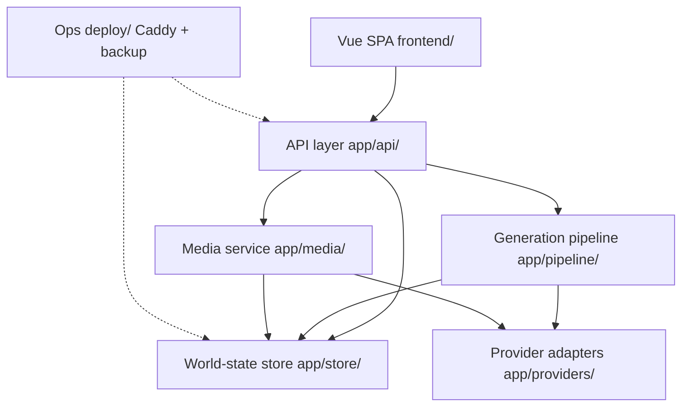
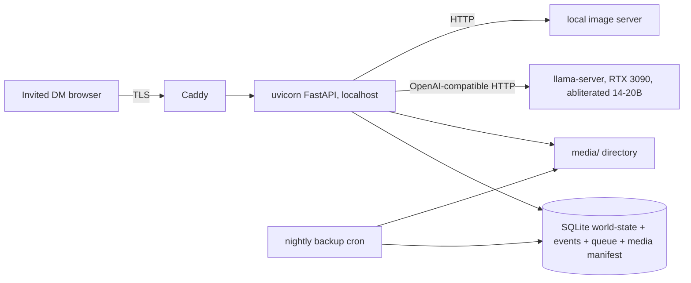
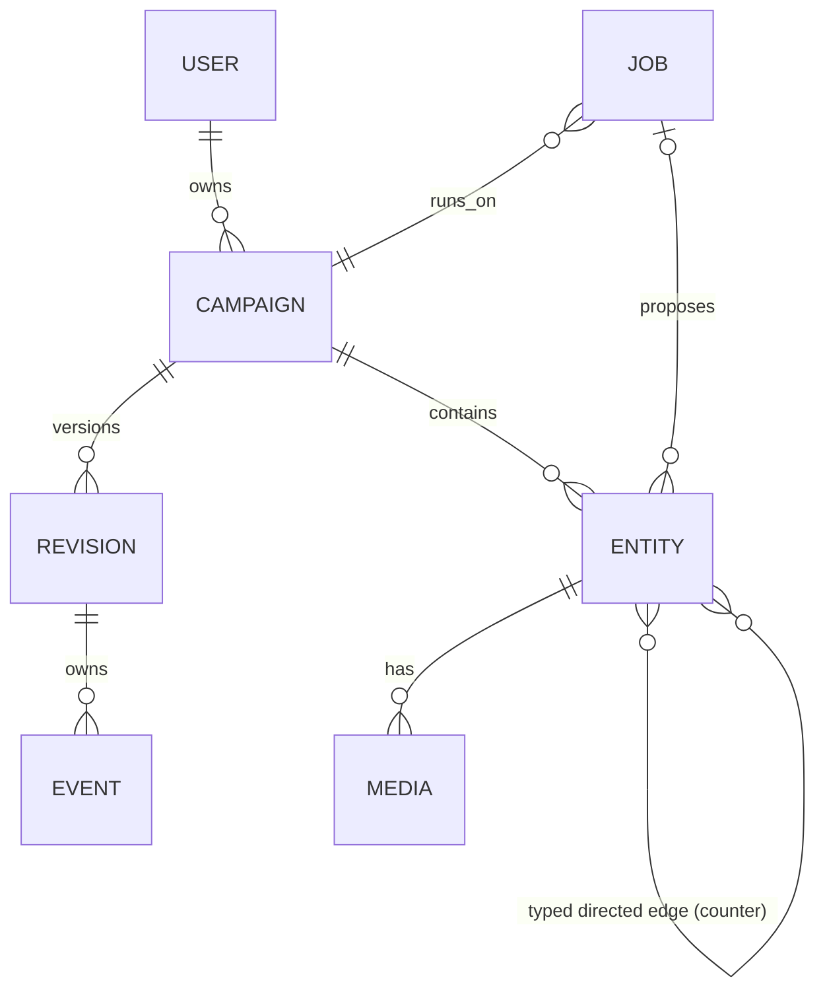

# Architecture Diagrams — mythosCircle

Derived from the final spine (`ARCHITECTURE-SPINE.md`, status: final). Diagrams are the load-bearing view of layering, deployment, and data model; prose rules live in the spine's ADs.

## Dependency direction (who may depend on whom)

Rule the diagram encodes: `api/` orchestrates; `pipeline/` proposes; `store/` commits; `providers/` are leaves (no inbound deps except from pipeline/media); nothing except `store/` writes world state.



## Deployment (single machine — AD-8)



## Core entities (names + relationships only)



## Minimal structural tree

```text
mythosCircle/
  backend/
    app/
      api/        # routes: campaigns, entities, edges, jobs, media, exports, auth
      core/       # config, auth, errors, events
      store/      # revisions, event log, commit path, queue, media manifest
      pipeline/   # job runner, retrieval, generators (character/faction/place/simulate)
      providers/  # llm, image, video — OpenAI-compatible adapters
      media/      # media service (write/reclaim/validate)
    tests/        # store + pipeline unit tests
  frontend/
    src/          # Vue SPA: views per capability, Pinia world-state stores
  deploy/         # config.toml, caddy, systemd units, backup cron + restore script
```
